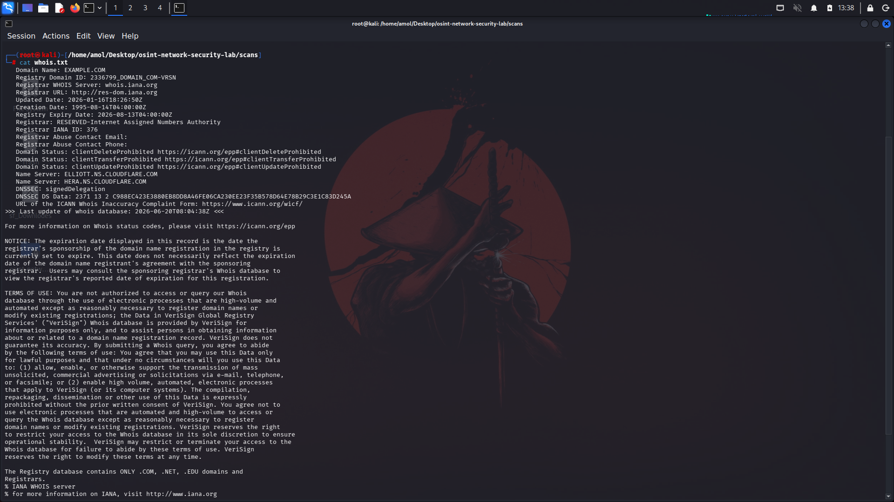
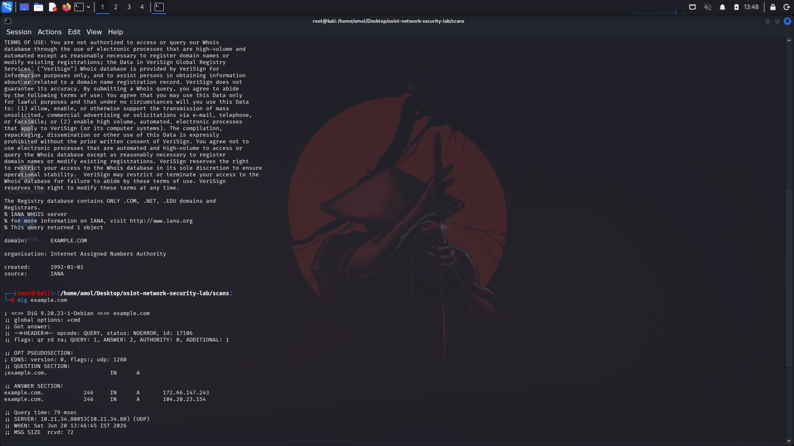
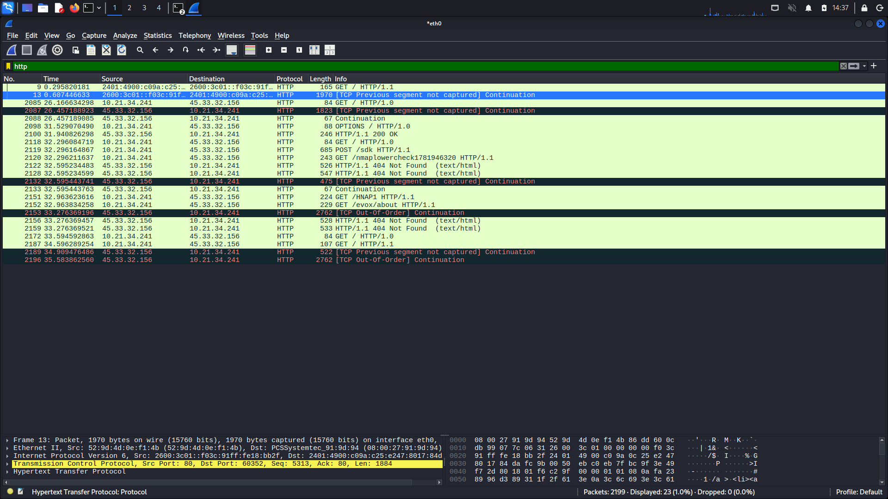
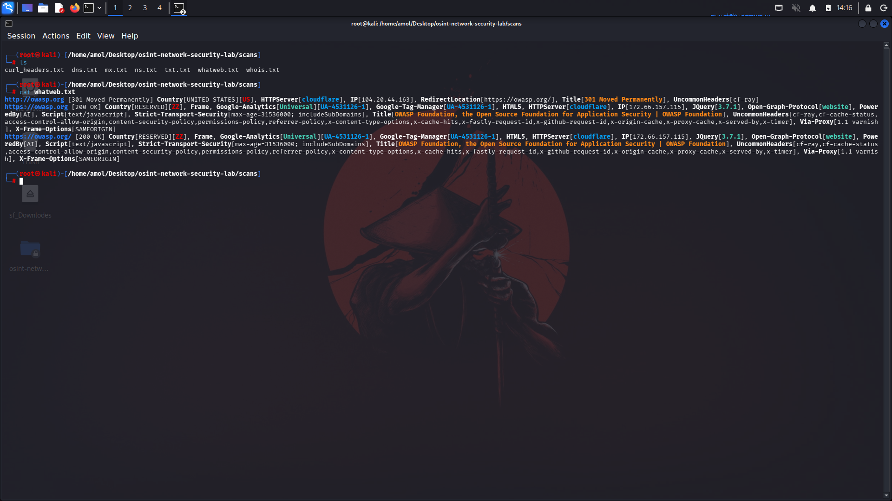
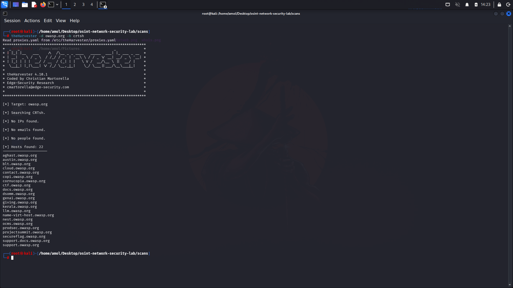
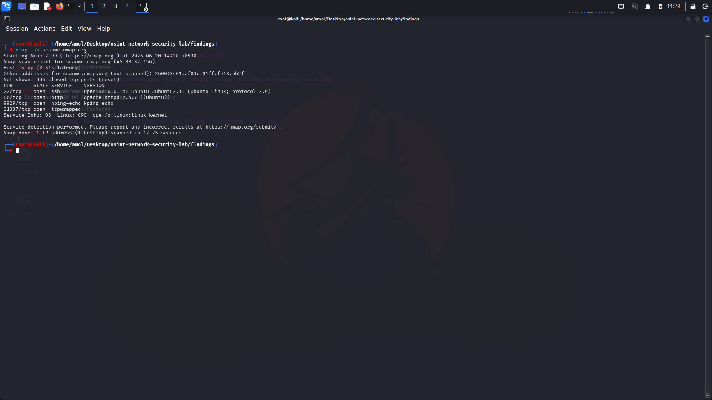
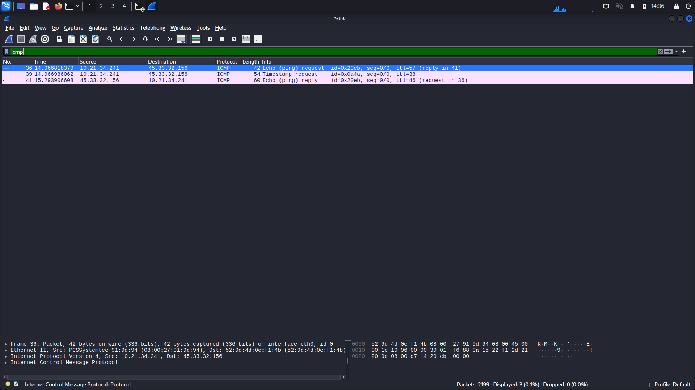
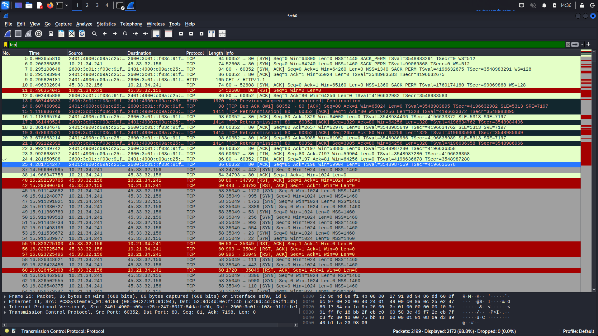

# 🔍 OSINT Reconnaissance & Network Security Lab

<p align="center">


</p>

Hands-on cybersecurity lab demonstrating passive reconnaissance, service enumeration, web fingerprinting, packet analysis, and documentation techniques commonly used during security assessments.

---

# ⚠ Disclaimer

This project was performed exclusively against authorized and publicly available targets.

Targets used:

* example.com
* owasp.org
* scanme.nmap.org

---

# 🎯 Objectives

* Perform passive OSINT reconnaissance.
* Enumerate DNS information.
* Analyze HTTP response headers.
* Identify web technologies.
* Discover subdomains.
* Enumerate services and open ports.
* Capture and analyze network traffic.
* Document findings and remediation recommendations.

---

# 🛠 Technologies Used

* Kali Linux
* WHOIS
* dig
* curl
* WhatWeb
* theHarvester
* Nmap
* Wireshark

---

# 🔬 Methodology

## Passive Reconnaissance

* WHOIS Enumeration
* DNS Enumeration
* HTTP Header Analysis
* Web Fingerprinting
* Subdomain Enumeration

## Active Enumeration

* Nmap Service Detection

## Packet Analysis

* Wireshark Packet Capture
* Protocol Analysis

---

# 📊 Findings Summary

## DNS Enumeration

Successfully identified:

* A Records
* MX Records
* NS Records
* TXT Records

---

## Web Technologies

Target:

* owasp.org

Technologies discovered:

* Cloudflare
* jQuery 3.7.1
* Google Analytics
* Google Tag Manager

---

## Subdomain Enumeration

Discovered 22 subdomains using Certificate Transparency logs.

---

## Service Enumeration

Target:

* scanme.nmap.org

Open Ports:

* 22/tcp → SSH
* 80/tcp → HTTP
* 9929/tcp → Nping Echo
* 31337/tcp → tcpwrapped

---

## Packet Analysis

Observed protocols:

* ICMP
* TCP
* HTTP

---

# 📁 Project Structure

```text
osint-network-security-lab
├── findings
├── reports
├── scans
├── screenshots
├── scripts
└── wireshark
```

---

# 📸 Screenshots

## WHOIS Enumeration



---

## DNS Enumeration



---

## HTTP Header Analysis



---

## WhatWeb Fingerprinting



---

## theHarvester Enumeration



---

## Nmap Service Enumeration



---

## Wireshark Packet Analysis

### ICMP Traffic



### TCP Traffic



---

# 🚀 Skills Demonstrated

* OSINT & Reconnaissance
* DNS Enumeration
* HTTP Header Analysis
* Web Fingerprinting
* Subdomain Enumeration
* Service Enumeration
* Packet Analysis
* Documentation & Report Writing

---

# 🔮 Future Improvements

* Automated Reconnaissance Scripts
* OWASP Top 10 Mapping
* Vulnerability Assessment
* SIEM Log Analysis
* Advanced Packet Analysis

---

# 📜 License

Distributed under the MIT License.

---

# 👨‍💻 Author

**Amol Nimade**

GitHub: https://github.com/Amol1307

LinkedIn: https://www.linkedin.com/in/amol-nimade-0b3436289

---

⭐ If you found this repository useful, consider giving it a star.
